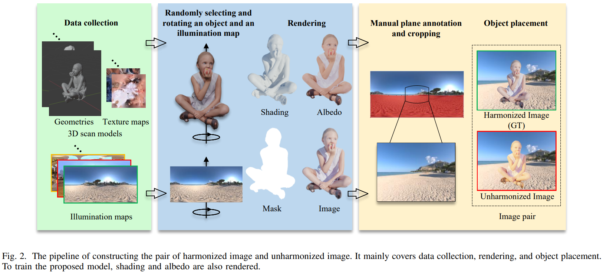

# IllumHarmony-Dataset
The IllumHarmony-Dataset for SIDNet: Learning Shading-aware Illumination Descriptor for Image Harmonization (IEEE TETCI 2023).

## [Project page](https://waldenlakes.github.io/IllumHarmony/) | [Dataset](https://github.com/waldenlakes/IllumHarmony-Dataset) | [Code](https://github.com/waldenlakes/SIDNet) | [Paper](https://arxiv.org/abs/2112.01314)

## Dataset Overview
We constructed a large-scale synthetic image harmonization dataset (called **IllumHarmony-Dataset** by us) where each pair of unharmonized and ground-truth images contains shading variation caused by different illumination. Compared to the widely-used [iHarmony4](https://github.com/bcmi/Image-Harmonization-Dataset-iHarmony4) dataset, the shading variation between the unharmonized and ground-truth images in our dataset is really in line with real-world image harmonization. It poses a greater challenge to existing image harmonization works. 

***Dataset construciton.*** The pipeline of dataset construction is given below. NOTE THAT our collected models/illumination are all captured from the real world, with the aim of achieving photo-realistic renderings. More details on dataset construction can be found in [our paper](https://arxiv.org/pdf/2112.01314.pdf).



***Dataset statistics.*** Our dataset has a total of 143,390 training images and 22,048 test images, which cover a wide range of scenes and illumination conditions. We split the training set and the test set into four categories based on illumination conditions as reported in the following Table.

| | Sunny | Sunrise/Sunset | Cloudy | Night | Total |
|:--------:|:--------:|:--------:|:--------:|:--------:|:--------:|
| #Train | 62,074 | 27,471 | 48,051 | 5,794 | 143,390 |
| #Test | 10,472 | 3,608 | 7,508 | 460 | 22,048 |

High-quality examples from our IllumHarmony-Dataset are shown in the figure below.


## Downloading Data
The IllumHarmony-Dataset (\~87GB) can be downloaded from [OneDrive](https://mailnwpueducn-my.sharepoint.com/:f:/g/personal/zy_h_mail_nwpu_edu_cn/ErvnvIfNCIRFri5WIs2ViLwBiGLzRxSiRVlW-_B_Hbn0ZQ?e=9d9g6z) or [BaiduCloud](https://pan.baidu.com/s/1EcEERSb97enNA4hIz-0fzA?pwd=jip4). This dataset is licensed under a [LICENSE](./LICENSE).

## Loading Data
We provide python scripts in the foloder [./data_utils](./data_utils) for loading data.

***loading training data.*** By running this script, you can get the composite training data from the rendered raw data. Note that for the input unharmonized composite image, its foreground illumination is randomly selected to increase the diversity of the IllumHarmony-Dataset.

    python data_utils/train_dataloader.py

***loading test data.*** Run the following script to get not only the input unharmonized image, mask and GT, but also the albedo image and the shading image.

    python data_utils/test_dataloader.py

If you want to use the final composed images (including input, mask, and GT) directly, please download them from [OneDrive](https://mailnwpueducn-my.sharepoint.com/:u:/g/personal/zy_h_mail_nwpu_edu_cn/EcqoHdjvZxpFimWcRd9Zu2EBKvwbsqFMv8vvsHRfRA5NJw?e=gVyzcZ) or [BaiduCloud](https://pan.baidu.com/s/1e2AsV70t3kv74UbKXh2URQ?pwd=a3zq).

## Real Data from User Study
In addition to the IllumHarmony-Dataset, we also built [a small image harmonization dataset](https://drive.google.com/file/d/1x33zHuDCfWkjNV-h-ito3zVkR5wxMIVf/view?usp=sharing) consisting of 58 real composite images for user study. We provided [our SIDNet results](https://drive.google.com/file/d/1GIT5WKoM9jdOTHM6Un2kQQLY2ss58KA8/view?usp=sharing) on this small dataset to facilitate possible future comparative studies.

## Citation

If you use these data in your research, please cite:

```
@article{hu2023sidnet,
  title={{SIDNet}: Learning Shading-aware Illumination Descriptor for Image Harmonization},
  author={Hu, Zhongyun and Nsampi, Ntumba Elie and Wang, Xue and Wang, Qing},
  journal={IEEE Transactions on Emerging Topics in Computational Intelligence},
  year={2023}
}
```

## Contact
If you have any questions, please contact <zy_h@mail.nwpu.edu.cn>.
